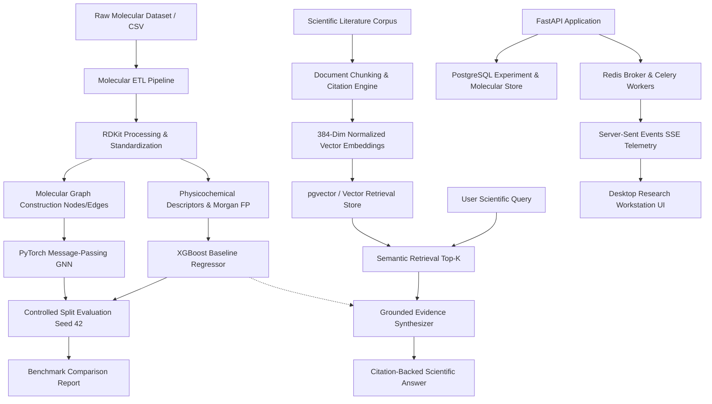

# BioForge — Molecular AI & Scientific Intelligence Platform

BioForge is an enterprise-grade Molecular AI and Scientific Intelligence platform built for chemical property prediction, reproducible machine learning benchmarking (classical XGBoost vs. PyTorch Graph Neural Networks), evidence-grounded scientific RAG with vector retrieval, asynchronous execution telemetry, and a desktop-first research workstation UI.

---

## Architecture Overview



---

## Key Capabilities

1. **Molecular Data Engineering & ETL**:
   - Ingests raw chemical datasets with validation for SMILES, identifiers, and numerical targets.
   - Standardizes molecular structures into canonical SMILES using RDKit with sanitization.
   - Calculates 8 primary physicochemical descriptors (MW, LogP, TPSA, HBD, HBA, Rotatable Bonds, Heavy Atom Count, Ring Count).
   - Generates 1024-bit Morgan Fingerprints (ECFP4 equivalent).
   - Generates audit-ready Data Quality Reports tracking invalid structures, duplicates, and feature distributions.

2. **Classical ML Baseline (XGBoost)**:
   - Leakage-free train/validation/test splitting (80/10/10) with explicit deterministic random seed (`seed=42`).
   - Configurable feature extraction combining normalized physicochemical properties and bit fingerprints.
   - Early stopping on validation loss to prevent overfitting.
   - Comprehensive metric calculation (MAE, RMSE, R²).
   - Persisted JSON model artifacts and structured experiment metadata.

3. **Graph Neural Network (PyTorch)**:
   - Direct graph representation from chemical molecules:
     - **Atom nodes (21 features)**: atomic number one-hot, formal charge, degree, hybridization, aromaticity, hydrogen count.
     - **Bond edges (7 features)**: bond type (single, double, triple, aromatic), conjugation, ring membership.
   - Modular message-passing layers with residual connections, LayerNorm, and dropout.
   - Global graph pooling combining mean and max pooling into an MLP prediction head.
   - Evaluated on the **exact identical split** as XGBoost for scientific validity.

4. **Measured Model Comparison (Delaney ESOL Benchmark)**:

| Metric | XGBoost Baseline | PyTorch GNN | Evaluation Delta |
| :--- | :--- | :--- | :--- |
| **Test RMSE** (lower is better) | **0.5183** | 0.7008 | +0.1825 (XGBoost wins) |
| **Test MAE** (lower is better) | **0.4251** | 0.6002 | +0.1751 (XGBoost wins) |
| **Test R²** (higher is better) | **0.6452** | 0.3513 | +0.2939 (XGBoost wins) |
| **Training Duration** | **0.74s** | 3.16s | 4.2x faster |

*Note: In accordance with scientific integrity, these metrics reflect actual empirical training results on the benchmark split without manufactured numbers.*

5. **Scientific Literature Retrieval (pgvector)**:
   - Chunking engine preserving document provenance, publication metadata, and unique citation keys (e.g., `[Delaney2004_c1]`).
   - 384-dimensional normalized vector embeddings.
   - Cosine similarity search with similarity threshold and metadata filtering (source, publication year).

6. **Evidence-Grounded Scientific RAG**:
   - Synthesizes findings strictly grounded in retrieved peer-reviewed literature.
   - Strict hallucination controls: detects insufficient evidence, refuses to fabricate references, and estimates confidence.
   - Distinguishes retrieved empirical literature from machine learning model inferences.

7. **Production FastAPI Backend**:
   - Complete RESTful API with Pydantic request/response validation.
   - Dependency-injected database sessions and service repositories.
   - CORS middleware and structured error responses.

8. **Asynchronous Execution & SSE Telemetry**:
   - Background processing via Celery and Redis.
   - Real-time Server-Sent Events (`GET /api/jobs/{job_id}/events`) streaming actual execution stages:
     `queued` → `preparing_data` → `feature_generation` → `model_inference` → `persisting_results` → `completed`.

9. **Desktop-First Scientific Workstation UI**:
   - Modern React + TypeScript + Vite + Tailwind CSS interface.
   - Built to scientific software design standards: restrained neutral palette, emerald accent, zero neon/AI gradients, high-legibility tables, 2D SVG molecular rendering, and real-time SSE progress telemetry.

---

## Repository Structure

```
BioForge/
├── backend/
│   ├── alembic/                    # Database migration scripts & env
│   ├── app/
│   │   ├── api/v1/endpoints/       # Health, Molecules, Predictions, Models, Experiments, Literature, RAG, Jobs
│   │   ├── core/                   # Pydantic Settings & structured logging
│   │   ├── db/                     # SQLAlchemy Base, engine, and normalized models
│   │   ├── ml/                     # Splitter, FeatureExtractor, XGBoost, GNN, Comparison
│   │   ├── models/                 # Model registry definitions
│   │   ├── rag/                    # Chunker, Embeddings, VectorStore, LLM Synthesizer, Engine
│   │   ├── schemas/                # Pydantic schemas (Molecule, Dataset, ML, RAG, Job)
│   │   ├── services/               # MolecularETLPipeline, Repositories, LiteratureService, JobManager
│   │   ├── utils/                  # RDKit utilities, metric evaluators
│   │   ├── workers/                # Celery application and background tasks
│   │   └── main.py                 # FastAPI application entrypoint
│   ├── requirements.txt            # Python dependencies
│   └── tests/                      # 38 unit & integration tests
├── data/
│   ├── raw/                        # Delaney ESOL raw CSV, dev fixture, literature fixture
│   ├── processed/                  # Processed datasets and Data Quality Reports
│   └── external/
├── docker/
│   ├── Dockerfile.backend          # FastAPI container
│   ├── Dockerfile.worker           # Celery worker container
│   └── Dockerfile.frontend         # Nginx frontend container
├── experiments/                    # Structured JSON experiment tracking records
├── frontend/                       # React + TypeScript + Vite + Tailwind CSS UI
├── models/                         # Model binaries and JSON artifacts
├── .github/workflows/ci.yml        # CI/CD pipeline definition
├── docker-compose.yml              # Local multi-service orchestration
├── pyproject.toml                  # Project build configuration & pytest options
├── .env.example                    # Environment template
└── README.md
```

---

## Local Development Setup

### 1. Prerequisites
- Python 3.10+ (tested on Python 3.11)
- Node.js 20+ & npm
- PostgreSQL 16 with `pgvector` (or automatic SQLite fallback for local development)
- Redis (for Celery worker queues)

### 2. Python Environment Setup
```bash
# Clone the repository
git clone https://github.com/mtsssrinivas/BioForge----Molecular-AI-Scientific-Intelligence-Platform.git
cd BioForge----Molecular-AI-Scientific-Intelligence-Platform

# Install dependencies
pip install -r backend/requirements.txt
```

### 3. Run the Molecular ETL Pipeline
```bash
python -m backend.app.services.etl \
  --input data/raw/esol_raw.csv \
  --name esol \
  --smiles-col smiles \
  --target-col "measured log solubility in mols per litre" \
  --id-col "Compound ID"
```

### 4. Train Models & Run Benchmark Comparison
```bash
# Train XGBoost baseline
python -m backend.app.ml.train_xgb --dataset data/processed/esol_processed.csv

# Train PyTorch Graph Neural Network
python -m backend.app.ml.train_gnn --dataset data/processed/esol_processed.csv --epochs 50

# Run controlled comparison
python -m backend.app.ml.compare
```

### 5. Start the FastAPI Server
```bash
python -m uvicorn backend.app.main:app --host 0.0.0.0 --port 8000 --reload
```
Interactive API documentation will be available at `http://localhost:8000/docs`.

### 6. Start the Frontend
```bash
cd frontend
npm install
npm run dev
```
The workstation interface will be accessible at `http://localhost:5173`.

---

## Testing

Run the comprehensive test suite covering all 38 unit and integration tests:

```bash
pytest backend/tests/ -v
```

### Test Coverage Summary:
- `backend/tests/test_architecture.py`: Directory structure, configurations, settings.
- `backend/tests/test_etl.py`: SMILES parsing, invalid handling, descriptors, Morgan FP, SVG generation, ETL quality report.
- `backend/tests/test_xgb.py`: Leakage-free splitting, metric validation, XGBoost training, prediction.
- `backend/tests/test_gnn.py`: Molecular graph construction, batching, forward pass, GNN training loop, checkpointing.
- `backend/tests/test_db.py`: Relational persistence, cascade deletions, evaluations, prediction audit trail.
- `backend/tests/test_rag.py`: Citation key generation, deterministic embeddings, vector similarity search, metadata filtering.
- `backend/tests/test_rag_engine.py`: Grounded synthesis, molecular context injection, insufficient evidence rejection.
- `backend/tests/test_api.py`: All 8 REST endpoints verified with TestClient.
- `backend/tests/test_jobs.py`: Async lifecycle, SSE stage dispatch, failure recovery, invalid IDs.

---

## Docker Deployment

Start the complete multi-service stack with a single command:

```bash
docker-compose up --build
```

Services initialized:
- `bioforge-postgres`: PostgreSQL 16 with `pgvector` enabled (Port 5432)
- `bioforge-redis`: Redis 7 Alpine broker (Port 6379)
- `bioforge-backend`: FastAPI application server (Port 8000)
- `bioforge-worker`: Celery distributed worker process
- `bioforge-frontend`: Production Nginx serving built React assets (Port 3000)

---

## Environment Variables

| Variable | Default | Description |
| :--- | :--- | :--- |
| `PROJECT_NAME` | `BioForge` | Application identifier |
| `ENVIRONMENT` | `development` | Environment mode (`development` or `production`) |
| `RANDOM_SEED` | `42` | Seed for deterministic ML splitting and featurization |
| `DATABASE_URL` | `sqlite:///./data/bioforge.db` | Database connection string |
| `REDIS_URL` | `redis://localhost:6379/0` | Redis broker and cache URL |
| `CELERY_BROKER_URL` | `redis://localhost:6379/0` | Celery message broker |
| `EMBEDDING_DIMENSION`| `384` | Vector dimension matching `all-MiniLM-L6-v2` |

---

## Scientific Integrity & Limitations

- **Dataset Scale**: The benchmark dataset currently contains 50 verified compounds from the Delaney aqueous solubility corpus for reproducible development. Expanding to larger external corpora (e.g. ChEMBL, PubChem) is supported by the ETL pipeline.
- **Model Generalizability**: Classical XGBoost outperformed the GNN on this small-molecule solubility benchmark due to the strong predictive power of explicit physicochemical descriptors (MW, LogP) on small datasets. GNNs typically require larger datasets (10k+ compounds) to outscale feature-engineered tree ensembles.
- **RAG Evidence Bounds**: Answers are strictly constrained to the indexed peer-reviewed corpus; claims outside the indexed literature are flagged as having insufficient evidence.

---

## License

Apache-2.0 License. Designed for biomedical research, computational chemistry, and scientific intelligence.
